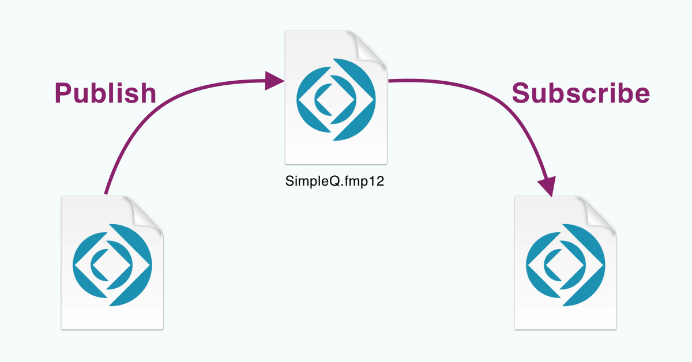

## Intro

In this guided walk-through, you will learn how to use SimpleQ to publish messages from one file and subscribe to messages from another. We have included two files in the download for you to use in this demo.

- SimpleQ_Publisher_Demo.fmp12
- SimpleQ_Subscriber_Demo.fmp12

SimpleQ_Publisher_Demo.fmp12 will "publish" a message to a channel in SimpleQ. SimpleQ_Subscriber_Demo.fmp12 will subscribe to that same channel so it can receive that message.

### 

The "Message" we will be sending is just a simple "greeting".

1.  The greeting will be entered into a field in the SimpleQ_Publishing_Demo.fmp12 file.
2.  Clicking a "Send Message" button will "Publish that message to a channel in SimpleQ.fmp12.
3.  SimpleQ will then send the message to the SimpleQ_Subscriber_Demo.fmp12
4.  A script will set that value into a field.

## Prerequisites

You should have already followed the instructions in the [Installation](../installation) docs in order to get SimpleQ uploaded to your server. If you didn't do that, we recommend you do that now.
