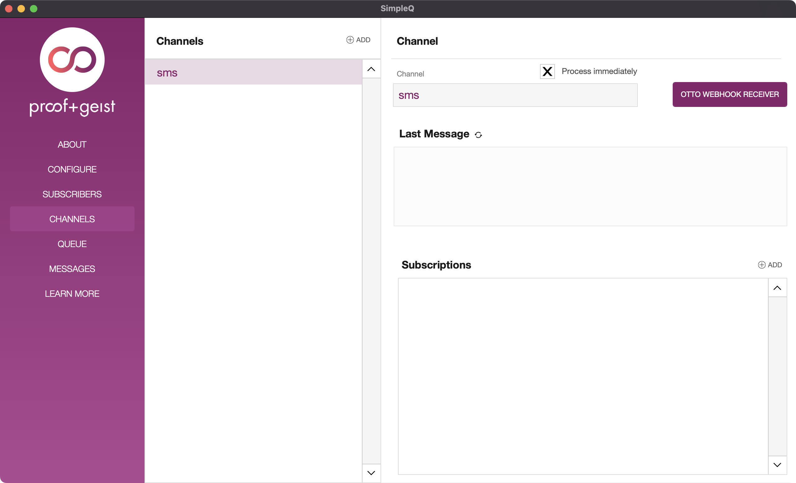

*Requires v1.3.0+*

There are some use cases when you don't want to wait until the server-scheduled script can run to flush all messages. For this, you can enabled the "Process Immediately" flag on the channel.

With this flag enabled, messages sent to this channel will attempt to send to their subscriber scripts immediately after they are published. 

:::note
Just like other messages in SimpleQ, your process that publishes the message will **not** get a response from the subscribers, but merely an indication that message was received.