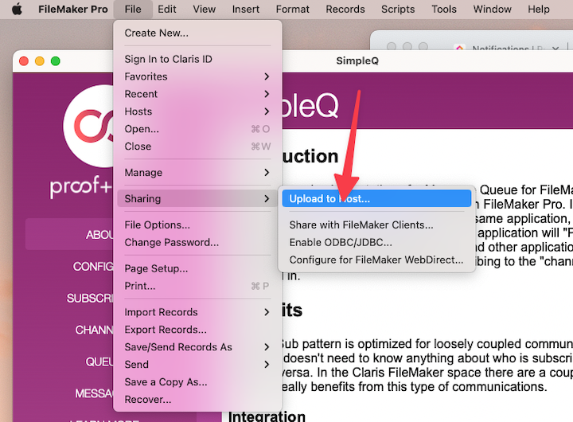
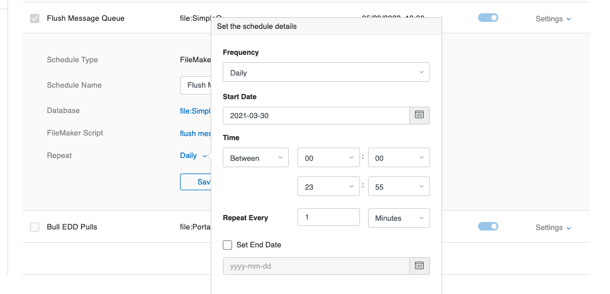

:::note
The Getting Started Guide requires SimpleQ to be hosted on your Server.
:::

## Intro

This document provides instructions on how to host and configure SimpleQ on your FileMaker server. SimpleQ is designed to run on a FileMaker Server, as it uses Server-side scripting extensively. While it might be possible to make use of SimpleQ without a server we do not provide documentation for that approach.

## Prepare SimpleQ.fmp12 for your server.

Download the latest version of SimpleQ from [Github](https://github.com/proofgeist/SimpleQ). The archive will contain a README. We encourage you to read it. The most important thing it tells you is the admin credentials for the file.

### Change password on two accounts.

Open the file with the default credentials and immediately change the password for the "admin" account and for the "server" account. Make sure you make note of those passwords because you will need them later.

### Upload to your server.

Use FileMaker Pro to upload SimpleQ to your server.

## Setup a FileMaker Server Scheduled script.

SimpleQ uses a server-side script to process messages. We suggest that you set that up right away. Log into your FileMaker server's admin console. Navigate to the Configuration tab and select "Script and Verify Schedules."

- Create a new Schedule.
- Set the "Schedule Type" to "FileMaker Script"
- Give the schedule a name; for example: "SimpleQ Flush"
- Choose SimpleQ as the database.
  - Use the server credentials you modified above to authenticate to the database.
- Choose the Script "flush message queue"
- Set it to repeat every day, every minute. This is what we use most of the time, but you can adjust this as necessary.
- Select your new schedule, and press Run Now to test that it works.

## Optionally create external data sources for subscriber files.

SimpleQ will call scripts in other files that have subscribed to the message channels. In order to do that three things need to be set up.

If you don't have other files right now or if you are going to follow the [Getting Started Guide](/) you can skip this step.

1.  An external file reference from SimpleQ to the other file.
2.  The other file must authorize SimpleQ to be able to access it. This is done in Manage Security ➝ File Access. In this image, a file called Portal has authorized SimpleQ
3.  Add the Server account to the other file(s). SimpleQ will use the "server" account to run all scripts.

## Optional Otto configuration

While Otto is not required to use SimpleQ, the two work really well together. If you don't have Otto yet, you can skip this step.

Otto's webhook feature can connect directly to SimpleQ's channels. If you configure SimpleQ to connect to your Otto server, SimpleQ will generate the webhook URLs for each channel. This makes it very easy to add a channel and immediately get the Webhook URL that will publish to it.

Configure the Otto server address on the SimpleQ Configure screen. Use the "Test" Button to make sure it is connected correctly.

## Celebrate

That's it. SimpleQ is hosted on your FileMaker server and ready to go!
