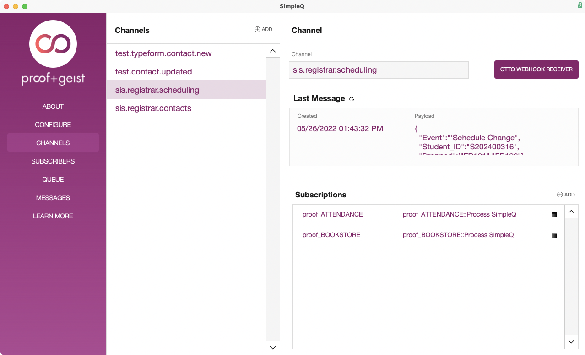
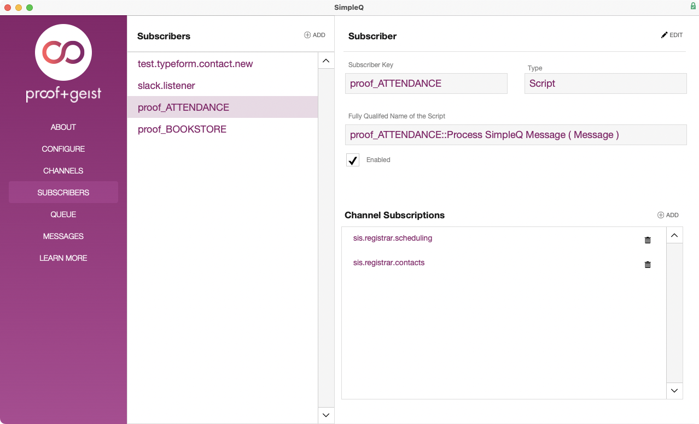

## Overview

SimpleQ is a messaging service that allows applications to work together in a loosely-coupled fashion. SimpleQ uses the Publish/Subscribe design pattern to broker messages between a Publisher and a Subscriber. To understand how SimpleQ operates, it's helpful to think about how tightly-coupled applications work together. Consider the following scenario:

> In a Student Registration System, a student decides to Drop their French class and add a Spanish class. The Registrar makes the changes to the student's schedule in the system. Other modules may depend on the Registration system for their information, such as the Bookstore to produce a list of required texts or an Attendance system for recording class attendance, and need to be notified in the event of a schedule change.

In a tightly-coupled architecture, the **Registration** system would have a connection to both the **Bookstore** and **Attendance** systems, and when making the schedule change it would call the functions in those modules directly. This requires the **Registration** system to know which methods to call and the format of the parameters needed for those methods. This can lead to many problems, particularly if the developer doesn't control all the systems involved.

In a loosely-coupled architecture, the **Registration** system would not call the **Bookstore** and **Attendance** systems directly. Instead, it would publish the schedule change event as a Message. The other systems would be notified of the new Message available for processing, and are responsible for invoking whatever scripts are necessary.

There are several benefits to a loosely-coupled architecture, including increased scalability, improved performance, and asynchronous operation. Combined with [Otto's webhooks Receiver](https://www.ottofms.com/docs/developer-api/receiving-web-hooks), SimpleQ even makes it easier to integrate with external systems.

## Messages

Messages are the way that applications communicate with each other. Typically a Message is in response to an event. A Message can be anything, from a notification that an operation has finished to data in response to a query. In the above Registration scenario, the Message might a combination, including the event that occurred (Schedule Change) as well as the data related to the event (the changed courses or the new schedule). For ease and simplicity Messages are encoded as JSON.

```plain
{
  "Event":"Schedule Change",
  "Student_ID":"S202400316",
  "Dropped":["FR101","FR102"],
  "Added":["SP101","SP102"]
}
```

The Publisher doesn't need to know anything about the other systems that will receive the Message, it is solely responsible for defining the message format that Subscribers will use to determine how to handle the message. If a new system is added that relies on the same data nothing need change on the Publisher's end, we simply add a new Subscriber.

#### What is a Publisher?

A Publisher is the system where the event occurred, that then sends a Message in response to that event. In our example above the Student Registration System is the Publisher, the event is the schedule change, and the Message is the JSON description of what changed.

The Publisher doesn't know who the Subscribers are or even if there are any Subscribers. Instead, the Publisher concerns itself with sending a Message to the SimpleQ server when an event has occurred. The Publisher defines the Message format for each event type. In our example the Publisher has defined the following format for schedule change events:

```plain
{
  "Event":"A JSON string indicating the type of event, e.g. 'Schedule Change'",
  "Student_ID":"A JSON string containing the external identifier for the Student.",
  "Dropped":"A JSON array containing the identifier for each class that was Dropped",
  "Added":"A JSON array containing the identifier for each class that was dded"
}
```

In addition, the Publisher will define the Channel in which it will publish a Message for a particular event. A Publisher may choose to publish Messages for all events in a single channel, or it may choose to group different events into different channels, and publish the Messages in the Channel corresponding to the event type. In our example system above, the **Registration** system may choose to define a "Scheduling" channel for events related to class schedules and a "Contact" channel for events related to changes to student contact data.

## What is a Channel?

A Channel is a way to group Messages for Subscribers. Rather than broadcast all Messages to all Subscribers, Channels give the Subscriber a way to only receive Messages of interest. This cuts down on the amount of data being sent over the network, and frees up compute time that would otherwise have been spent processing and discarding unwanted Messages. There is no limit to the number of Channels to which a Publisher can send Messages, nor to the number of Channels that a Subscriber can follow.



Channels are defined as a path using dot-notation. This enables the Subscriber to follow multiple Channels from a Publisher rather than having to subscribe to each Channel individually. In the above example, a Subscriber following the channel "sis.registrar" will receive Messages for both the "sis.registrar.scheduling" channel as well as the "sis.registrar.contacts" channel.

## What is a Subscriber?

Subscribers are the systems that listen for Messages on a Channel. The Subscriber defines a Listener function that will receive and process any Message that was received. This Listener function is provided to the SimpleQ server, which will contact the Subscriber by sending the Message to the Subscriber as a parameter to the Listener.



In our example above, the **Attendance** and **Bookstore** systems have been configured as Subscribers, with the Attendance system subscribed to the "sis.registrar.contacts" and "sis.registrar.scheduling" channels.
